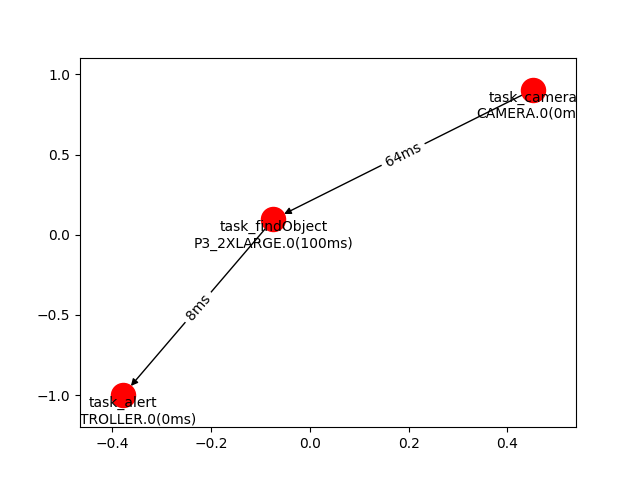

# Demo

All examples are in the folder `placethings/demo`

## Usage

To run all test cases:
```
sudo python main.py demo -tc run_all.Test
```

To run one test case:
```
$ python main.py -tc TESTCASE_MODULE.TESTCASE -c CONFIGFILE
```
For example:
```
$ python main.py -tc test_ddflow_demo_local.Test -c sample_configs/test_ddflow_demo_local
```
- <b>TESTCASE_MODULE</b> is the file name of your test case in placethings/demo
- <b>TESTCASE</b> is the name of the class that contains your test function.

To add one test case, please inherit <b>placethings.demo.BaseTestCase</b> and implement your own test logic in <b>test()</b> method.

## Dependencies

Some of the demo cases runs tasks that depends on a sample docker image and code from the sample library. 
- The docker image is build from the `Dockerfile` in the folder `sample_tasklib`
- The source code for those predefined tasks are in the folder `sample_tasklib`

## Demo case explain

Consider the demo case: test_ddflow_demo_local.

In this demo we will first emulate IoT devices and the network environment, and invoke compuptation tasks on each device according to our placement decision made based on device capability and network status.

### Emulation of devices and networks
This demo reads the configuration files in `sample_configs/test_ddflow_demo_local` and creates multiple docker containers and a virtual network (mininet). Each container represent one device in the configuration file, and mininet emulates the network links between them.

Here is an example of the network topology based on the configuration `sample_configs/test_ddflow_demo_local`. In this graph only network devices (switches and access points) are shown.


Here is an example of adding IoT devices to the existing network topology based on the configuration `sample_configs/test_ddflow_demo_local`


### Computation placement

Here is an example of an IoT application described in `sample_configs/test_ddflow_demo_local`


There are three components in this application
- task_camera: a camera sensor that captures images
- task_findObject: a task that processes data. We use yolo, an object recognition algorithm to find objects of interest in the image
- task_alert: an auctuator that informs subscribers about the objects captured by the camera. We use a web server to display the information.

placethings applies the ILP algorithm described in [ilp.md](ilp.md), and then makes placement decision. For example:


### Invoke computation tasks

As we run the demo case through:
```
$ sudo python main.py -tc test_ddflow_demo_local.Test -c sample_configs/test_ddflow_demo_local
```


The placethings will show all the information of the emulated devices and networks. As shown in the example below, five docker containers are created:
- a camera sensor (CAMERA.0), which has exposed port to the outside and can be accessed through
  * the docker NAT network at `172.18.0.2:19000`
  * a binded port on your machine `localhost:20000`
- a controller that runs task_alert (CONTROLLER.0), which has exposed port to the outside and can be accessed through
  * the docker NAT network at `172.18.0.3:19000`
  * binded ports on your machine `localhost:20001`
- multiple computing devices (P3_2XLARGE.0, T3_LARGE.0, and T2_MICRO.0), which has exposed port to the outside and can be accessed through
  * the docker NAT network at `172.18.0.3:19000`, `172.18.0.4:19000`, and `172.18.0.5:19000`
  * binded ports on your machine `localhost:20002`, `localhost:20003`, `localhost:20004`

To simulate a camera capturing images, we can send image files to the fake camera device through `localhost:20000`.
```
$ python main_entity.py client_send_file -n client1 -a localhost:20000 -m push -al sample_img/2-0.png
```


Open a web browser at `localhost:20001` and we can see a car is found in the image.


## Other demo cases

Here are some sample demo cases:
- base_test.py: the abstract class for a test case. All test cases mus follow the data structure.
- test_config_wrapper.py: definie configuration, export/import configuration to `config_simple`
- test_ddflow.py: read configuration from `config_ddflow_*` folder, compute good placements, output estimated latency
- test_ddflow_demo.py: given configuration from `config_ddflow_demo`, create a fixed virtual network and a set of computation resources
- test_ddflow_demo_all.py: just like `test_ddflow_demo.py` but the virtual network changes dynamically
- test_graph.py: given any configuration json files, read the configuration and compute a good placement

Test cases for code under development:
- test_config_base.py: test code for refactoring the configuration interfaces and logic.
